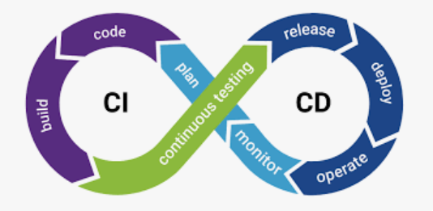

## Devops Script

### What is devops?

- bridge between development and IT/ops team to oversee the software release.
- aim is to make this process as efficient as possible
- devops use automation tool and put together a CI/CD pipeline

### What are the benefits?

- Software released to market faster
- Better quality software
- Increased collaboration and communication between teams
- Problems are resolved faster

### Role of devops?
- Troubleshooting and fixing issues in the pipeline
- Figuring out new ways on automating 
- Removing any bottlenecks
- Training and continuous learning 
- Building infrastructure 

### What is cloud computing 

Cloud computing allows end users to access computing resources - storage, remote servers, databases - over the internet on demand.

### Benefits of cloud computing

The key benefits to end users include:

- Cost savings: users only pay for the resources that they use, avoiding overprioritsing your own data centre and freeing up IT teams to do strategic work.
- scalability and flexibility: users can quickly scale resources and storage to meet changing business needs without needing to invest in physical infrastructure.
- Faster time to market: users can spin up new servers in seconds accelerating developement and deployment
- increased security: cloud providers invest heavily in security of their infrastructure.

### Companies using cloud computing

- Netflix - cloud computing to deliver its video content to millions of users around the world.
- Uber - uses cloud computing to power its ride-sharing platform, which connects riders with drivers in real-time
- Salesforce - ses cloud computing to deliver its software products to customers

### How does cloud compting fit into devops?

Cloud computing provides a flexible and scalable infrastures for the devops team to build, test and deploy applications and services.
